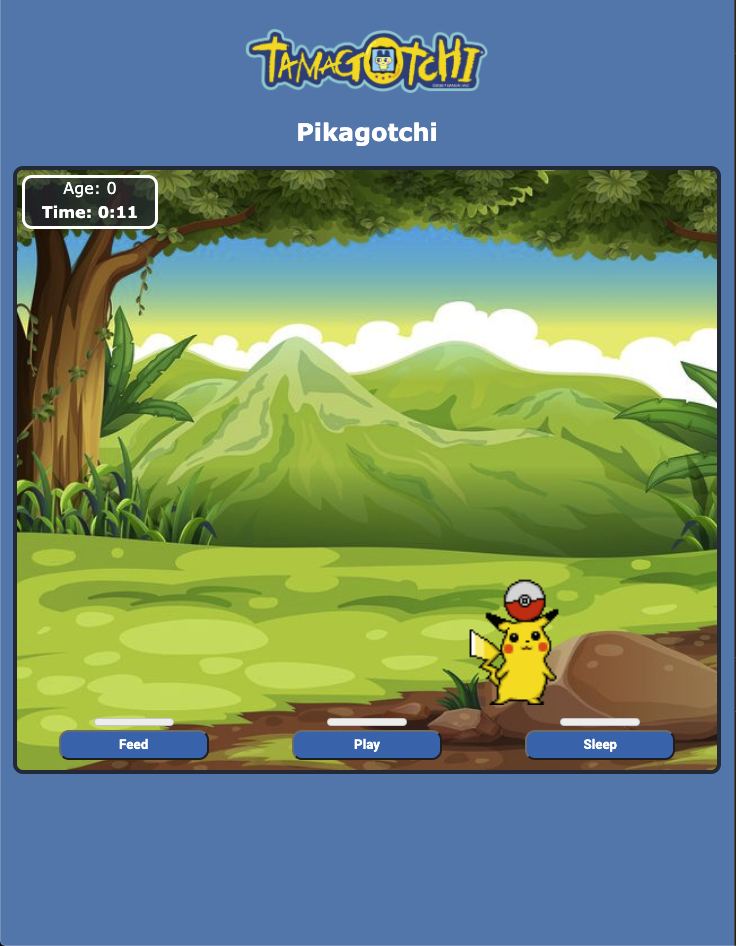
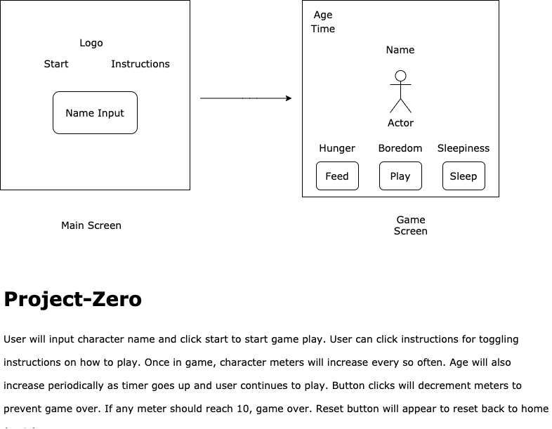

### Project-Zero:
- Project Tamagotchi. First project for General Assembly cohort #1207. Build your own version of the hit keychain game in the 90's...Tamagotchi.

### How To Play:
- To play choose your character and characters name. Your character will age periodically and it's hunger, boredom, and sleepiness will continue to go up. Interact with your charcter to keep it's levels low by clicking on the feed, play, and sleep meter. If any one of the meters should reach 10..game over!

### Gameplay:

### Installation:
- No installation required to play. Just load the URL in your browser of choice.

### Usage:
- For best user experience, game should be played on Google Chrome. Follow the 'how-to-play' instructions to play the game.

### Support:
- V1 of Project-Zero...ongoing features and updates being added continuously. Feel free to fork this repo and make contributions. Open to all ideas and suggestions.

### Roadmap:

### Technology:
- Project-Zero was built using HTML, CSS, JavaScript & jQuery during winter break of 2020.

### Live Game:
https://pages.git.generalassemb.ly/whobutjg/project-zero/
